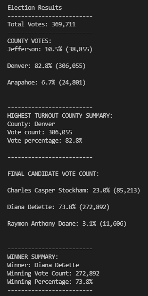
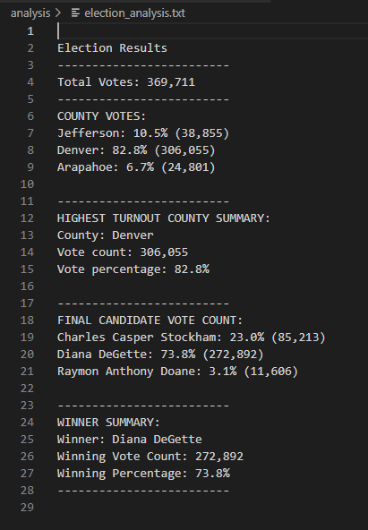

# Election_Analysis

## Project Overview:
A Colorado Board of Elections employee has given the following tasks to complete the election audit of a recent local congressional election. 

### Task assignment:
1. Total number of votes cast.
2. A complete list of candidates who received votes.
3. Total number of votes each candidate won.
4. Percentage of votes each candidate won.
5. The winner of the election based on popular vote.
6. The voter turnout for each county.
7. The percentage of votes from each county out of the total count.
8. The county with the highest turnout.

### Purpose of the Project:
To see if the above tasks needed for election audit can be automated.

---

## Resorurces:
- Data Source: election_results.csv
- Software: Python 3.7.6, Visual Studio Code, 1.63.1

---

## Election-Audit Results: 
    Below are the output of the Election analysis:
  
**Deliverable 1: Election Audit Results screenshot from Terminal**



**Deliverable 2: Election Audit Results screenshot from Text file**




1. How many votes were cast in this congressional election?
    - The below code snippet shows how the total votes was calculated.
    ```python
        # For each row in the CSV file.
        for row in reader:
            # Add to the total vote count
            total_votes += 1
     ```
2. Provide a breakdown of the number of votes and the percentage of total votes for each county in the precinct.
    - Below is the code snippet for calculating vote count and percentage for each county.
    ```python
        # 6a: Write a for loop to get the county from the county dictionary.
        for county_name in county_votes:

            # 6b: Retrieve the county vote count.
            county_vote = county_votes[county_name]

            # 6c: Calculate the percentage of votes for the county.
            county_percentage = float(county_vote) / float(total_votes) * 100

            # Save each county's name, vote count, and percentage of votes in a variable.
            county_results = (
                f"{county_name}: {county_percentage:.1f}% ({county_vote:,})\n")

            # 6d: Print the county results to the terminal.
            print(county_results)

            # 6e: Save the county votes to a text file.
            txt_file.write(county_results)
    ```

3. Which county had the largest number of votes?
    - Inside the **for** loop in the above code snippet I added the below code to determine the county with the largest number of votes.
    ``` python  
           # 6f: Write an if statement to determine the winning county and get its vote count.
            if (county_vote > highest_county_vote) and (county_percentage > highest_county_percentage):
                highest_county_vote = county_vote
                highest_county_turnout = county_name
                highest_county_percentage = county_percentage

        # 7: Print the county with the largest turnout to the terminal.
        highest_county_turnout_summary = (
            f"\n-------------------------\n"
            f"HIGHEST TURNOUT COUNTY SUMMARY:\n"
            f"County: {highest_county_turnout}\n"
            f"Vote count: {highest_county_vote:,}\n"
            f"Vote percentage: {highest_county_percentage:.1f}%\n"
            f"\n-------------------------\n")
        print(highest_county_turnout_summary)

        # 8: Save the county with the largest turnout to a text file.
        txt_file.write(highest_county_turnout_summary)        
    ```
4. Provide a breakdown of the number of votes and the percentage of the total votes each candidate received.
    - Below is the code snippet for calculating vote count and percentage for each candidate.
    ```python
        for candidate_name in candidate_votes:
            # Retrieve vote count and percentage
            votes = candidate_votes.get(candidate_name)
            vote_percentage = float(votes) / float(total_votes) * 100
            candidate_results = (
                f"{candidate_name}: {vote_percentage:.1f}% ({votes:,})\n")

    ```
5. Which candidate won the election, what was their vote count, and what was their percentage of the total votes?
    - Below is the code snippet for determining the winner of the congresstional election.
    ```python
        # Determine winning vote count, winning percentage, and candidate.
        if (votes > winning_count) and (vote_percentage > winning_percentage):
            winning_count = votes
            winning_candidate = candidate_name
            winning_percentage = vote_percentage

    ```

---

## Election-Audit Summary: 
    
The **total votes** cast in this congressional district is 369,711. Across the three counties - Jefferson, Denver and Arapahoe, Denver had the highest turnout accounting for 82.8% of the total votes cast. Below is the County votes summary.

    **COUNTY VOTES SUMMARY:**
    1. Jefferson: 10.5% (38,855)
    2. Denver: 82.8% (306,055)
    3. Arapahoe: 6.7% (24,801)

The **winner** for this congressional district is Diana DeGette with the vote count of 272,892 which is 73.8% of total votes. Below is the final vote count for each candidate.

    **FINAL CANDIDATE VOTE COUNT:**
    1. Charles Casper Stockham: 23.0% (85,213)
    2. Diana DeGette: 73.8% (272,892)
    3. Raymon Anthony Doane: 3.1% (11,606)


### Potential opportunities:
The script written for doing the above audit can be also used for:

1. Other congressional district elections.
    - Include the data about congressional district (unique identifier) in the source data file.
    - Update the script to introducing variables to capture the Congresstional district ID.
        ```python
            # Track Congressional district
            congressional_district = []

            # For each row in the CSV file.
            for row in reader:
                # Get the Congressional district from each row.
                congressional_district = row[4]
        ```

    - In the output, print the Congresstional district ID in the Election Results.
        ```python
            # Print the final vote count (to terminal)
            election_results = (
                f"\nElection Results for {congressional_district}\n"
                f"-------------------------\n"
                f"Total Votes: {total_votes:,}\n"
                f"-------------------------\n"
                f"COUNTY VOTES:\n")
            print(election_results, end="")
            # Save the final vote count to the text file.
            txt_file.write(election_results)  
        ```

2. Senetorial elections 
    - by removing the county votes section as senetorial elections are at state level.
        ```python
            # Write an if statement to determine the winning county and get its vote count.
            if (county_vote > highest_county_vote) and (county_percentage > highest_county_percentage):
                highest_county_vote = county_vote
                highest_county_turnout = county_name
                highest_county_percentage = county_percentage
        
            # Print the county with the largest turnout to the terminal.
            highest_county_turnout_summary = (
                f"\n-------------------------\n"
                f"HIGHEST TURNOUT COUNTY SUMMARY:\n"
                f"County: {highest_county_turnout}\n"
                f"Vote count: {highest_county_vote:,}\n"
                f"Vote percentage: {highest_county_percentage:.1f}%\n"
                f"\n-------------------------\n")
            print(highest_county_turnout_summary)
            # Save the county with the largest turnout to a text file.
            txt_file.write(highest_county_turnout_summary)
        ```

3. Primary elections to determine candidates for general elections from each party by adding code to capture the party.
    - The data source file needs to have Party information
4. Local elections with little customization.


